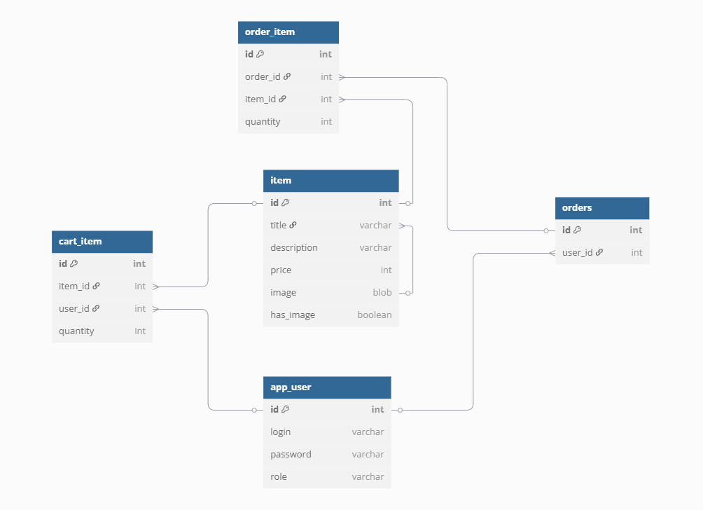

# Intershop

## Как собирать приложение
- Используем maven wrapper

## Как запускать приложение
### без Docker
#### [inter-shop](inter-shop)
- создаем базу данных в postgres (см. application.properties)
- запускаем Redis на порту 6379
- запускаем keycloak, добавляем клиента inter-shop, указываем секрет в spring.security.oauth2.client.registration.inter-shop.client-secret 
- далее запускаем как стандартное Spring Boot приложение
#### [inter-payment-server](inter-payment/inter-payment-server)
- запускаем как стандартное Spring Boot приложение

### c Docker
- запускаем команду `docker-compose up`
- в контейнере поднимаются:
  - keycloak с импортом настроек клиента
  - inter_shop_server_container
  - inter_shop_db_container
  - inter_shop_cache_container
  - inter_payment_server_container

## Как заполнить базу тестовымы данными
- используем страничку http://localhost:8080/admin/initial-loader
- нажимаем кнопку "Загрузить тестовые данные"
- после этого можно проверить, что данные загрузились в базу

## Как запускать тесты
Есть следующие тесты
- Интеграционный тест с полным контекстом
  [IntegrationTest.java](src/test/java/ru/yandex/practicum/intershop/integration/IntegrationTest.java)
- Тест репозитория
  [ItemRepositoryTest.java](src/test/java/ru/yandex/practicum/intershop/repository/ItemRepositoryTest.java)
тесты запускаются с использованием testcontainers

## Схема БД
