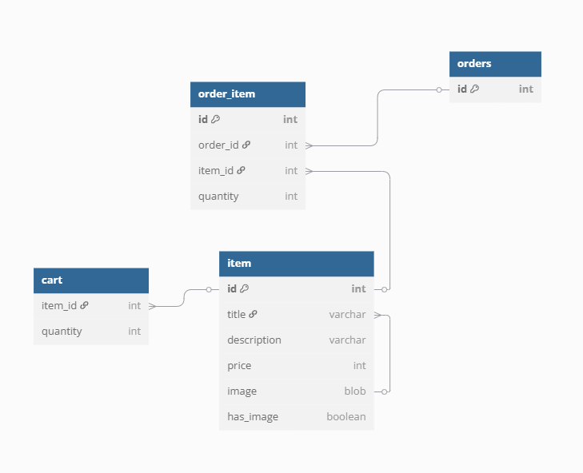

# Intershop

## Как собирать приложение
- Используем maven wrapper

## Как запускать приложение
### без Docker
- создаем базу данных в postgres (см. application.properties)
- далее запускаем как стандартное Spring Boot приложение

### c Docker
- запускаем команду `docker-compose up`
- в контейнере поднимается приложение и база данных

## Как заполнить базу тестовымы данными
- используем страничку http://localhost:8080/admin/initial-loader
- нажимаем кнопку "Загрузить тестовые данные"
- после этого можно проверить, что данные загрузились в базу

## Как запускать тесты
Есть следующие тесты
- Интеграционный тест с полным контекстом
  [IntegrationTest.java](src/test/java/ru/yandex/practicum/intershop/integration/IntegrationTest.java)
- Тест репозитория JPA
  [ItemRepositoryTest.java](src/test/java/ru/yandex/practicum/intershop/repository/ItemRepositoryTest.java)
тесты запускаются с использованием testcontainers

## Схема БД
